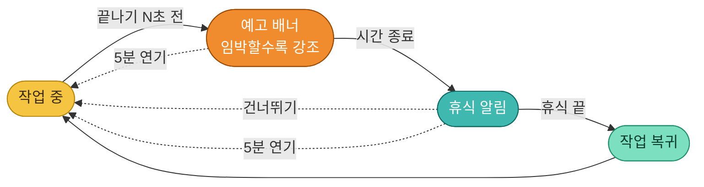
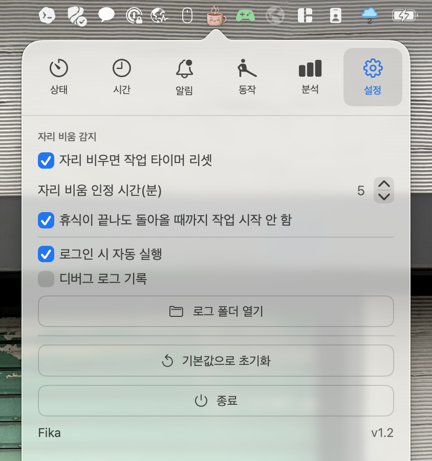

# Fika ☕️

<p align="center">
  
</p>

한자리에 오래 앉아 있지 않도록, **작업과 휴식의 전환을 놓치지 않게** 챙겨 주는 macOS 메뉴바 앱입니다.
혼자 쓰려고 만든 개인용입니다. Swift + SwiftUI로 작성했고, **Xcode 없이 Command Line Tools 만으로** 빌드합니다.

> 이름은 스웨덴어 **fika** — "커피 한 잔과 함께 잠깐 멈춰 재충전하는 시간"을 뜻합니다. *잠깐 쉬자*는 이 앱의 정신과 그대로 맞닿아 있습니다.

---

## 핵심 아이디어

단순한 알람은 울려도 무시하기 쉽고, 휴식이 "언제 끝났는지"도 흐지부지되기 쉽습니다. Fika는 이렇게 풀어냅니다:



**예고 → 휴식 → 복귀** 3단계로 나눠 어느 전환도 놓치지 않게 하고, 이미 쉬고 있었다면(자리 비움) 타이머를 알아서 되돌립니다.

---

## 마스코트

상태에 따라 표정과 김이 바뀌는 커피 마스코트입니다 ☕

| 작업 중 | 곧 휴식 | 휴식 중 | 휴식 완료 |
|:---:|:---:|:---:|:---:|
|  |  |  |  |

<!-- TODO: 실제 앱 스크린샷을 docs/ 에 panel.png / break.png / warning.png 로 찍어 넣고 아래 표의 주석을 풀면 됩니다.
| 통합 패널 (상태) | 휴식 오버레이 | 예고 배너 |
|---|---|---|
|  |  |  |
-->

---

## 주요 기능

- **메뉴바 커피 마스코트** ☕ — 작업·곧 휴식·휴식·복귀 상태에 따라 표정과 김이 바뀌는 애니메이션 (휴식 화면과 진행 링에도 등장)
- **메뉴바 통합 패널** (BetterMouse 스타일 탭 UI) — 상태 · 시간 · 알림 · 동작 · 분석 · 설정 6개 탭
- **원형 진행 링** — 남은 시간이 단계별 색으로 차오름 (작업=앰버, 곧 휴식=주황, 휴식=청록, 복귀=민트)
- **예고 배너** — 휴식 N초 전부터 상단에 등장, 임박할수록 노랑→빨강으로 강조
- **휴식 알림 2가지 스타일**
  - `전체화면 덮기` — 화면을 가려 작업을 확실히 멈춤
  - `부드러운 효과` — 화면 가장자리 글로우 + 작은 카드 (그 아래로 계속 작업 가능)
- **건너뛰기 / 5분 연기** 버튼
- **"이번만 N분 뒤 휴식"** 빠른 칩 — 영구 설정은 그대로 둔 채 이번 세션만 조정
- **자리 비움(유휴) 감지** — 키보드·마우스·트랙패드·조이스틱 등 모든 HID 입력 기준. 이미 쉬고 있었다면 작업 타이머 리셋
- **sleep/wake 보정** — 노트북을 닫았다 열어도 잔 시간만큼 보정해 깨자마자 휴식으로 떨어지지 않음. 충분히 잤다면 작업을 새로 시작
- **휴식 후 복귀 대기** — 휴식이 끝나도 돌아와 입력하기 전까진 작업을 시작하지 않아, 자리 비운 시간이 작업으로 헛돌지 않음
- **작업 다시 시작** — 집중이 끊겼을 때 작업 타이머를 처음부터 수동 리셋
- **작업 중 동작 알림** — 앉아서 가볍게 할 동작(고개·어깨·눈·손목 등)을 커피 친구가 주기적으로 안내. 문구·주기 편집 가능
- **남은 시간 알림** — 메뉴바 시간 표시와는 별개로, 작업 중 "휴식까지 N분"을 주기적으로 잠깐 표시 (켬/끔·주기 설정). 동작 알림과 겹칠 땐 알아서 양보
- **집중 분석** — 완료한 세션을 기록해 일/주/월 집중 시간을 막대 차트로 표시 (막대를 탭하면 상세)
- **메뉴바 아이콘 테마** — 커피 잔(애니메이션) / 이모지(컬러) / SF 심볼(단색)에 **컴팩트(아이콘만) 모드**까지. 시간을 감추면 아이콘에 마우스를 올렸을 때 상태·남은 시간이 작은 카드로 표시
- **전환 사운드**, **로그인 시 자동 실행**, **멀티 디스플레이 대응**

---

## 탭 구성

| 탭 | 내용 |
|---|---|
| **상태** | 진행 링(가운데 마스코트) · 오늘/이번주 집중 요약 · 일시정지/재개 · 지금 휴식·작업 다시 시작 · "이번만 N분" 칩 |
| **시간** | 작업 / 짧은 휴식 / 긴 휴식(시간·주기) / 휴식 예고(초) / 연기 길이 |
| **알림** | 메뉴바 아이콘 테마 · 시간 표시 토글 · 아이콘 미리보기 · 남은 시간 알림(켬/끔·주기) · 휴식 알림 방식 · 사운드 |
| **동작** | 작업 중 동작 알림 켜기·주기 · 동작 문구 편집(한 줄에 하나) |
| **분석** | 일/주/월 집중 시간 막대 차트(막대 탭 시 상세) · 기간 합계 |
| **설정** | 자리 비움 감지 · 휴식 복귀 대기 · 로그인 자동 실행 · 디버그 로그 · 기본값 초기화 · 종료 |

모든 설정은 **저장 버튼 없이 즉시 적용**됩니다. 단, 작업/휴식의 "분" 값만은 지금 돌고 있는 단계엔 소급되지 않고 **다음 단계부터** 반영됩니다.

기본값은 **작업 50분 · 휴식 10분 · 4번째마다 긴 휴식 20분 · 예고 60초 · 연기 5분 · 자리 비움 5분**입니다.

---

## 빌드 & 실행

```bash
./build.sh            # swift build (release) → Fika.app 조립 + ad-hoc 서명
open Fika.app         # 메뉴바에 아이콘 등장 (Dock 아이콘 없음)
pkill -f MacOS/Fika   # 종료
```

콘솔 로그를 보며 실행하려면: `./Fika.app/Contents/MacOS/Fika`
필요한 것: Xcode Command Line Tools (`xcode-select --install`) — Xcode 본체는 필요 없습니다.

친구에게 줄 zip을 만들려면:
```bash
./package.sh          # → Fika-<버전>.zip 생성 + 설치 안내문 출력 (현재 1.2)
```

---

## ⚠️ 메뉴바에 아이콘이 안 보일 때 (노치 맥)

**앱 문제가 아니라 메뉴바 공간이 부족한 탓입니다.** 노치 있는 MacBook은 메뉴바 오른쪽이 꽉 차면
새 상태 아이콘이 노치 왼쪽(앱 메뉴 영역)으로 밀려 가려집니다. 화면이 좁을수록 더 자주 생깁니다.

해결 방법:
1. **알림 탭에서 "메뉴바에 남은 시간 표시"를 끄면** 컴팩트(아이콘만) 모드가 되어 폭이 최소가 됩니다.
2. **메뉴바 관리 앱 [Ice](https://icemenubar.app/)**(무료)를 설치하고 Fika 아이콘을 **"Always Visible"** 구역에 두면, 노치 화면에서도 항상 보입니다.
   ```bash
   brew install --cask jordanbaird-ice
   ```
3. 아니면 다른 메뉴바 앱 한두 개를 종료해 공간을 비웁니다.

> 넓은 외장 모니터에서는 자리가 넉넉해 보통 그냥 보입니다.

---

## ✅ 설치 후 꼭 — 로그인 시 자동 실행 켜기

Fika는 **켜져 있어야 작동**하는 상주 앱입니다. 그런데 자동 실행은 **기본값이 꺼짐**이라,
이걸 안 켜면 맥을 재시작할 때마다 사라져서 "어, 안 뜨네?" 하게 됩니다.
**처음 설치하면 한 번만 켜 두세요.**

**설정 탭(맨 오른쪽 ⚙️) → "로그인 시 자동 실행" 체크**

<p align="center">
  
</p>

> 💡 안정적으로 쓰려면 **`Fika.app`을 `/Applications`로 옮긴 뒤** 켜는 걸 권장합니다.
> (ad-hoc 서명이라 앱 경로가 바뀌면 등록된 로그인 항목이 깨질 수 있습니다.)
>
> ```bash
> cp -R Fika.app /Applications/
> open /Applications/Fika.app
> ```

---

## 친구에게 공유 / 설치

App Store 등록 없이도 배포할 수 있습니다. 비공개 레포라면 받는 사람을 **collaborator로 초대**하면 됩니다.

> ☕ **받은 친구가 "메뉴바에 안 보여요" 하면** 노치에 가려진 것입니다 (위 "노치 맥" 섹션 참고). 앱은 정상 실행 중이니 메뉴바 정리나 Ice 설치로 해결됩니다.

### A. 소스로 직접 빌드 (권장 — Gatekeeper 경고 없음)
레포를 받아 [위 "빌드 & 실행"](#빌드--실행)대로 `./build.sh && open Fika.app` 하면 됩니다.
```bash
xcode-select --install                  # 처음 한 번만
git clone <레포-URL> && cd fika
```
직접 빌드하면 격리(quarantine) 속성이 붙지 않아 경고 없이 바로 실행됩니다.

### B. 빌드된 .app 내려받기 (GitHub Releases 등)
다운로드한 앱은 ad-hoc 서명이라 격리 속성을 한 번 풀어 줘야 합니다:
```bash
xattr -dr com.apple.quarantine /Applications/Fika.app
```
또는 **시스템 설정 → 개인정보 보호 및 보안 → "그래도 열기"**로 허용합니다.
경고 자체를 없애려면 Apple Developer ID 서명과 공증(notarization)이 필요합니다 (연 $99, App Store 심사와는 무관).

---

## 프로젝트 구조

| 파일 | 역할 |
|---|---|
| `FikaApp.swift` | 앱 진입점. `NSStatusItem`+`NSPopover`로 메뉴바 아이콘/패널 직접 생성 |
| `Panel.swift` | 통합 패널 (탭바 + 상태/시간/알림/동작/분석/설정 6개 탭, 진행 링, 차트, 버튼 스타일) |
| `BreakEngine.swift` | 작업/휴식 상태머신 (두뇌), 진행도·단계 색 |
| `Settings.swift` | 설정 모델, UserDefaults 자동 저장 |
| `Idle.swift` | IOKit `HIDIdleTime`으로 유휴 시간 측정 (모든 HID 장치) |
| `OverlayController.swift` / `OverlayViews.swift` / `OverlayWindows.swift` | 휴식 오버레이·예고 배너·시작 토스트 윈도우와 뷰 |
| `CoffeeAnimation.swift` / `MascotCut.swift` / `CoffeeIcon.swift` | 메뉴바 마스코트(영상 프레임 재생) / 화면 UI 마스코트 컷 / 절차적 컵(폴백) |
| `Log.swift` | 파일 로거(`~/Library/Logs/Fika/`) + 미처리 예외 핸들러 |
| `Stats.swift` | 집중 세션 기록 저장(`~/Library/Application Support/Fika/sessions.json`) + 일/주/월 집계 |
| `LoginItem.swift` / `Sound.swift` | 로그인 자동 실행 / 전환 사운드 |
| `Resources/` | `coffee/`(메뉴바 프레임)·`cuts/`(화면 컷)·`AppIcon.icns`(앱 아이콘) |
| `Info.plist` | `LSUIElement`(Dock 미표시)·아이콘 등 번들 설정 |
| `build.sh` / `package.sh` | 빌드+`.app` 조립+ad-hoc 서명 / 친구 공유용 zip 생성 |

---

## 동작 메모

- 메뉴바 아이콘은 SwiftUI `MenuBarExtra` 대신 **`NSStatusItem`** 으로 직접 만듭니다 (환경 의존성 회피).
- 유휴 감지는 입력 "내용"이 아니라 **마지막 입력 후 경과 시간만** 읽으므로 별도 권한이 필요 없습니다.
- Dock 아이콘 없이 메뉴바 전용(`.accessory`)으로 동작합니다.

---

## 라이선스

[MIT](LICENSE) © 2026 Jinkook Choi
